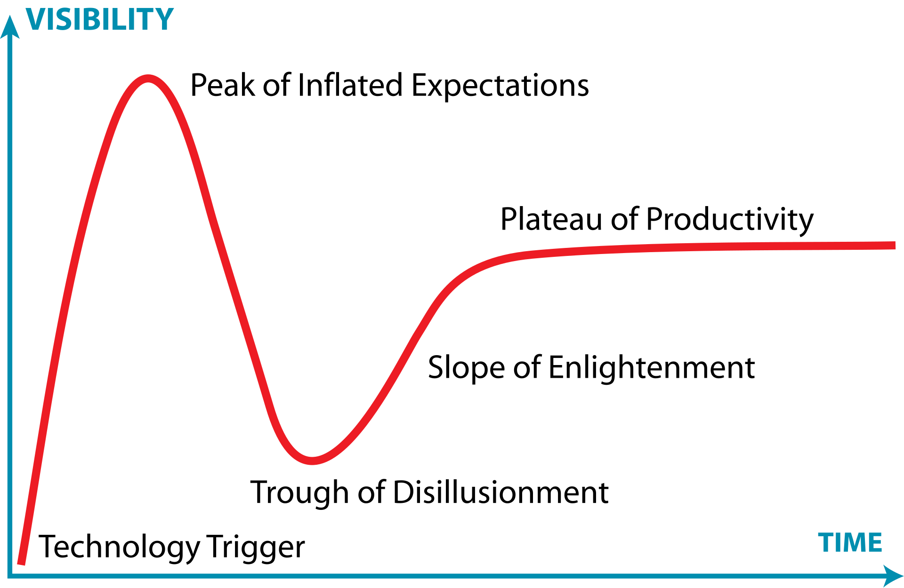

# **1. Introdução aos Microsserviços**

Microsserviços vem se tornando uma escolha arquitetural cada vez mais popular, ao menos desde a segunda metade da última década. Embora as ideias fundamentais já existissem antes mesmo disso, a corrida para utilizá-los solidificou práticas testadas e introduziu novos conceitos, enquanto algumas abordagens anteriores caíram em desuso. Começaremos examinando as ideias centrais, o que nos trouxe até aqui e por que essas arquiteturas são tão amplamente utilizadas.

## **1.1 Microsserviços em Resumo**

Em sua essência, **microsserviços são serviços que podem ser liberados (released) de forma independente e que são modelados em torno de um domínio de negócio**. Cada serviço encapsula uma funcionalidade específica e a torna acessível a outros serviços através da rede, permitindo a construção de sistemas complexos a partir desses blocos menores. Por exemplo, em um sistema de e-commerce, um microsserviço poderia cuidar do inventário, outro da gestão de pedidos e um terceiro do envio, mas juntos eles formariam o sistema completo.

Trata-se de uma escolha arquitetural focada em oferecer múltiplas opções para resolver os problemas que você pode enfrentar. Eles são um tipo de **arquitetura orientada a serviços (SOA)**, porém com opiniões bem definidas sobre como os limites dos serviços devem ser desenhados e com a **implantação independente** como característica chave. Uma grande vantagem é que são **agnósticos à tecnologia**.

Do ponto de vista externo, um microsserviço é tratado como uma **caixa preta**. Ele expõe sua funcionalidade de negócio através de um ou mais endpoints de rede (como uma fila de mensagens ou uma API REST, conforme ilustrado na Figura 1-1 do livro). Consumidores, sejam outros microsserviços ou diferentes tipos de programas, acessam essa funcionalidade por meio desses endpoints. Detalhes internos de implementação, como a tecnologia em que o serviço foi escrito ou a forma como os dados são armazenados, são completamente ocultos do mundo exterior. Isso significa que, na maioria das vezes, arquiteturas de microsserviços evitam o uso de bancos de dados compartilhados; em vez disso, cada microsserviço encapsula seu próprio banco de dados quando necessário.

Os microsserviços abraçam o conceito de **ocultação de informação (information hiding)**. Isso significa esconder o máximo de informação possível dentro de um componente e expor o mínimo necessário através de interfaces externas. Essa prática permite uma separação clara entre o que pode mudar facilmente (implementação interna) e o que é mais difícil de mudar (interfaces de rede). Desde que as interfaces de rede não mudem de forma incompatível com versões anteriores, a implementação interna oculta pode ser alterada livremente. Mudanças dentro dos limites de um microsserviço não devem afetar um consumidor, possibilitando a **liberação independente de funcionalidades**. Isso é essencial para permitir que os microsserviços sejam trabalhados isoladamente e liberados sob demanda.

Ter limites de serviço claros e estáveis, que não mudam com a implementação interna, resulta em sistemas com **acoplamento mais fraco e coesão mais forte**. Ao falar sobre ocultar detalhes internos, é importante mencionar o padrão de **Arquitetura Hexagonal**, detalhado por Alistair Cockburn. Este padrão enfatiza a importância de manter a implementação interna separada de suas interfaces externas, com a ideia de que você pode querer interagir com a mesma funcionalidade através de diferentes tipos de interfaces. O autor do livro que estamos usando como base (Criando Microsserviços, 2a ed. de Sam Newman) desenha seus microsserviços como hexágonos em parte como uma homenagem a essa ideia.

## 1.2. SOA vs. Microsserviços: São a Mesma Coisa?

A evolução das arquiteturas de software reflete uma busca contínua por maior eficiência, modularidade e agilidade, impulsionada pelas crescentes complexidades dos sistemas e pelas dinâmicas de mercado. Essa jornada levou da predominância de aplicações monolíticas ao surgimento da Arquitetura Orientada a Serviços (SOA) e, posteriormente, à arquitetura de Microsserviços.

A SOA emergiu no início dos anos 2000 como uma resposta aos desafios dos sistemas monolíticos e como uma evolução natural das práticas de Integração de Aplicações Corporativas (EAI), que já buscavam conectar sistemas empresariais díspares. A SOA propunha a decomposição de funcionalidades de negócio em serviços reutilizáveis, comunicando-se através de padrões como Web Services (XML, SOAP, WSDL) e, frequentemente, orquestrados por um Barramento de Serviço Corporativo (ESB). O objetivo era promover a reutilização, a interoperabilidade e um melhor alinhamento entre TI e negócios.

Apesar de seus objetivos louváveis, muitas implementações SOA enfrentaram grandes desafios. A complexidade inerente às plataformas, os altos custos, os longos prazos de implementação e a dificuldade em definir a granularidade correta dos serviços foram críticas comuns. A governança, muitas vezes centralizada e pesada, podia minar a agilidade pretendida, e a dependência de ESBs robustos podia criar novos gargalos e pontos de acoplamento. 

O Gartner Hype Cycle ilustra bem a trajetória da SOA, que passou por um pico de expectativas inflacionadas seguido por um período de desilusão, à medida que as dificuldades práticas se tornavam evidentes. A imagem abaixo ilustra esse conceito.

Esses desafios pavimentaram o caminho para a busca por abordagens mais ágeis e descentralizadas e, nesse contexto, a arquitetura de microsserviços começou a se consolidar entre 2011 e 2012, não como uma teoria acadêmica, mas a partir de práticas emergentes em empresas que buscavam maior escalabilidade e velocidade de desenvolvimento, como a Netflix. Figuras como James Lewis e Martin Fowler foram chaves na articulação e disseminação do conceito. Os microsserviços propõem uma granularidade ainda mais fina, onde uma aplicação é composta por um conjunto de pequenos serviços autônomos, cada um focado em uma capacidade de negócio específica, executando em seu próprio processo e capaz de ser implantado independentemente. Essa independência é um grande diferencial, permitindo ciclos de desenvolvimento mais rápidos e maior resiliência. Um outro ponto importante a se considerar é que a ascensão dos microsserviços foi fortemente impulsionada por um ecossistema tecnológico favorável, incluindo a computação em nuvem, que oferece infraestrutura elástica e sob demanda; a cultura e as ferramentas DevOps, que promovem automação (CI/CD) e colaboração; e, fundamentalmente, as tecnologias de conteinerização como Docker e orquestradores como Kubernetes. Essas tecnologias simplificaram o empacotamento, a implantação e o gerenciamento de múltiplos serviços pequenos e independentes, tornando a arquitetura de microsserviços mais viável e acessível.

Portanto, embora compartilhem a herança da orientação a serviços, SOA e microsserviços não são a mesma coisa. Por exemplo, nos microsserviços há a filosofia dos "endpoints inteligentes e pipes burros" central, contrastando com a tendência de ESBs inteligentes na SOA, ao advogar por mecanismos de comunicação leves (como APIs RESTful) e pela autonomia da lógica de negócio dentro de cada serviço.

Dessa forma, microsserviços podem ser vistos como uma forma "evoluída" de SOA, uma tentativa de "fazer SOA da maneira correta", evitando as armadilhas comuns das implementações tradicionais. As diferenças são notáveis em diversos aspectos: os microsserviços têm escopo mais restrito e granularidade muito menor; favorecem a comunicação leve e descentralizada em vez de ESBs centralizados; promovem o gerenciamento de dados descentralizado, com cada serviço possuindo seu próprio banco de dados; e adotam uma governança mais distribuída e flexível. Enquanto a SOA frequentemente visava a reutilização de serviços em nível corporativo, os microsserviços priorizam a independência e a velocidade de entrega de cada serviço.

Podemos concluir, assim, que a transição de SOA para microsserviços representa uma adaptação às novas realidades tecnológicas e de negócios. A SOA introduziu conceitos fundamentais de modularidade e serviços, mas suas implementações muitas vezes resultaram em complexidade e rigidez. Os microsserviços refinaram esses conceitos, enfatizando a autonomia, a implantação independente e a descentralização, tendo sido alavancados por tecnologias como nuvem e contêineres.
